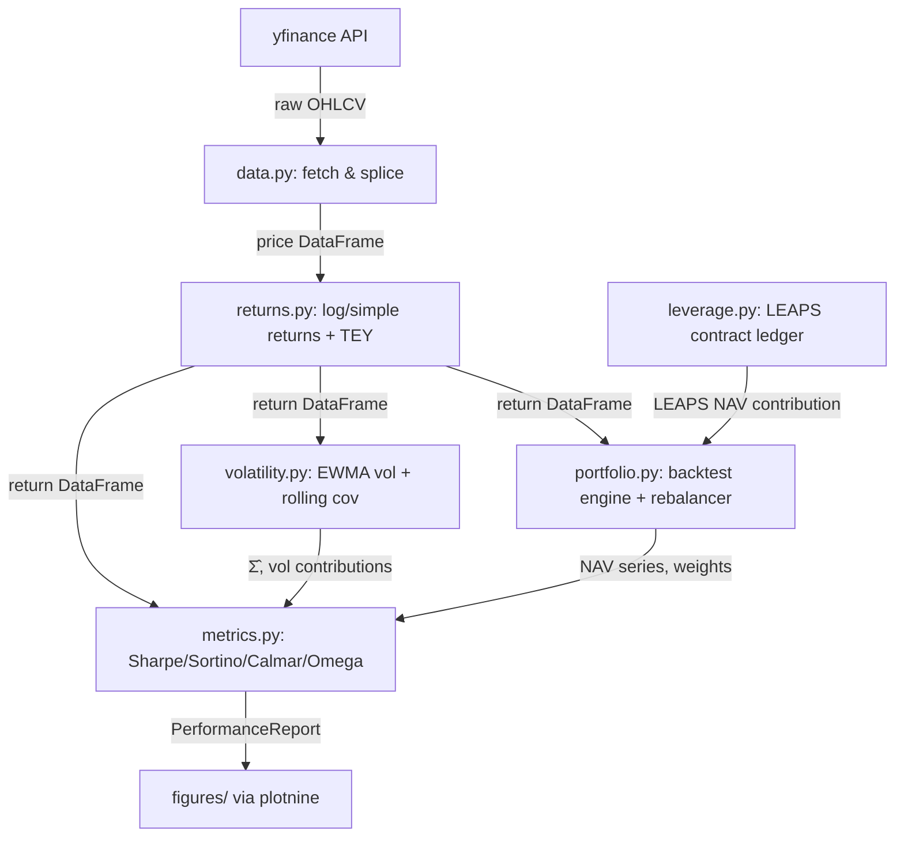

# Project: Finance Backtesting & Forward Projection Library

## 1. System Overview

A pure Python library for backtesting multi-asset portfolios with optional synthetic leverage via DITM VTI LEAPS. The system supports performance attribution, volatility forecasting, and tax-aware LEAPS roll modeling. It is designed as a reusable, testable library — not a one-off script.

**Core design principles:**
- `@dataclass(frozen=True)` for all data models (immutability)
- Pure functions for all business logic; I/O at the outermost edges
- Bottom-up build order: data → returns → volatility → metrics → portfolio → leverage
- Quarterly rebalancing (extensible to threshold-drift)
- User-specified weights (extensible to risk parity)

### System Data Flow



---

## 2. Tech Stack & Dependencies

| Category | Package | Purpose |
|---|---|---|
| Data | `yfinance` | Price history download |
| Data | `pandas` | Time-series DataFrame operations |
| Math | `numpy` | Vectorized numerical ops |
| Options | `scipy` | Black-Scholes via `scipy.stats.norm` |
| Plotting | `plotnine` | All charts (ggplot2-style) |
| Testing | `pytest`, `pytest-cov` | Test runner + coverage |
| Quality | `ruff` | Linting + import sorting |
| Quality | `mypy` | Static type checking (strict) |
| Runtime | Python 3.13 | Required |
| Env | `uv` | Package management + virtual env |

> **Testing policy:** This project does **not** use `mutmut` (mutation testing) or `hypothesis` (property-based testing). Standard `pytest` with ≥80% line coverage is the testing standard.

### pyproject.toml Configuration

```toml
[project]
name = "finance"
version = "0.1.0"
requires-python = ">=3.13"
dependencies = ["yfinance", "pandas", "plotnine", "numpy", "scipy"]

[project.optional-dependencies]
dev = ["pytest", "pytest-cov", "ruff", "mypy"]

[tool.ruff]
line-length = 100
target-version = "py313"

[tool.ruff.lint]
select = ["E", "W", "F", "I", "B", "C4", "UP", "N", "RUF"]

[tool.mypy]
python_version = "3.13"
strict = true

[tool.pytest.ini_options]
testpaths = ["tests"]
addopts = "--cov=src --cov-report=xml --cov-report=term-missing"

[tool.coverage.run]
source = ["src/finance"]
omit = ["tests/*", "**/__init__.py"]

[tool.coverage.report]
fail_under = 80
show_missing = true
```

---

## 3. Data Schema / Type Definitions

All data models use `@dataclass(frozen=True)`. Pandas DataFrames are the primary transport for time-series data — they are not wrapped in dataclasses (that would be over-engineering).

### 3.1 Core Data Models

```python
# data.py
@dataclass(frozen=True)
class PriceData:
    prices: pd.DataFrame          # DatetimeIndex × asset columns, adjusted close
    tickers: tuple[str, ...]
    start_date: str
    end_date: str
    spliced: bool                 # True if AQMIX/KMLM splice was applied

# returns.py
@dataclass(frozen=True)
class ReturnData:
    returns: pd.DataFrame         # DatetimeIndex × asset columns, simple returns
    log_returns: pd.DataFrame     # DatetimeIndex × asset columns, log returns
    tey_adjusted: bool            # True if VTEB TEY was applied
    marginal_rate: float          # e.g. 0.408

# leverage.py
@dataclass(frozen=True)
class LeapsContract:
    purchase_date: pd.Timestamp
    expiry_date: pd.Timestamp
    strike: float                 # 50% of spot at purchase
    spot_at_purchase: float
    premium_paid: float           # BS price at purchase
    notional: float               # spot_at_purchase * 100 (per contract)
    n_contracts: int
    account_type: AccountType     # enum: TAXABLE | TAX_SHELTERED

@dataclass(frozen=True)
class LeapsRollEvent:
    roll_date: pd.Timestamp
    old_contract: LeapsContract
    new_contract: LeapsContract
    gain_realized: float          # old_value - old_premium_paid
    tax_paid: float               # 0 if TAX_SHELTERED, else gain * 0.238
    net_proceeds: float           # old_value - tax_paid, reinvested in new contract

@dataclass(frozen=True)
class LeapsLedger:
    contracts: tuple[LeapsContract, ...]
    roll_events: tuple[LeapsRollEvent, ...]
    account_type: AccountType

# portfolio.py
@dataclass(frozen=True)
class PortfolioConfig:
    target_weights: dict[str, float]  # notional exposure / NAV, sums to 1.0
    initial_nav: float                # e.g. 1_000_000.0
    monthly_contribution: float       # e.g. 10_000.0
    rebalance_rule: RebalanceRule     # enum: QUARTERLY (extensible)
    weight_strategy: WeightStrategy   # enum: USER_SPECIFIED (extensible to RISK_PARITY)
    leaps_config: LeapsConfig | None

@dataclass(frozen=True)
class LeapsConfig:
    iv: float                         # constant implied volatility, default 0.18
    ltcg_rate: float                  # default 0.238
    account_type: AccountType

@dataclass(frozen=True)
class BacktestResult:
    nav_series: pd.Series             # DatetimeIndex, portfolio NAV over time
    weight_history: pd.DataFrame      # DatetimeIndex × asset, realized weights
    return_series: pd.Series          # DatetimeIndex, daily portfolio returns
    leaps_ledger: LeapsLedger | None
    config: PortfolioConfig

# metrics.py
@dataclass(frozen=True)
class PerformanceMetrics:
    annualized_return: float
    annualized_std: float
    max_drawdown: float
    sharpe: float
    sortino: float
    calmar: float
    omega: float
    period_label: str                 # e.g. "Full Period" | "GFC" | "COVID" | "2022 Rate Hike"

@dataclass(frozen=True)
class PerformanceReport:
    full_period: PerformanceMetrics
    crisis_periods: tuple[PerformanceMetrics, ...]
    vol_contribution_table: pd.DataFrame   # see Section 3.2
    forward_vol_forecast: float            # annualized σ̂_{p,t+1}

# volatility.py
@dataclass(frozen=True)
class VolatilityModel:
    ewma_vols: pd.Series              # per-asset EWMA vol at latest date
    rolling_corr: pd.DataFrame        # N×N correlation matrix (36-month weekly)
    cov_matrix: pd.DataFrame          # Σ̂_{t+1}, N×N
    lambda_: float                    # EWMA decay, default 0.95
```

### 3.2 Volatility Contribution Table Schema

```
| Asset | σ̃_k        | σ̂_k        | ρ̂_{VTI,k} | Contrib_k |
|-------|-------------|-------------|------------|-----------|
| VTI   | 0.142       | 0.138       | 1.000      | 0.412     |
| VXUS  | 0.151       | 0.147       | 0.891      | 0.298     |
| GLD   | 0.131       | 0.128       | -0.021     | 0.091     |
| VTEB  | 0.048       | 0.046       | 0.112      | 0.087     |
| KMLM  | 0.098       | 0.095       | -0.312     | 0.065     |
| VGIT  | 0.041       | 0.039       | -0.198     | 0.047     |
|       |             |             | **Sum**    | **1.000** |
```

Where:
- **σ̃_k**: 90-day trailing realized std (annualized)
- **σ̂_k**: EWMA forecasted vol (λ=0.95), annualized
- **ρ̂_{VTI,k}**: 36-month rolling weekly correlation with VTI
- **Contrib_k** = `w_k * (Σ̂ w)_k / σ²_p`, weights unit-normed, Σ=1

---

## 4. Component/Module Breakdown (API Definitions)

### 4.1 `data.py` — Fetch & Splice

```python
# Constants
TICKERS: tuple[str, ...] = ("VTI", "VXUS", "GLD", "VTEB", "KMLM", "VGIT")
KMLM_START: str = "2021-01-01"
AQMIX_PROXY_TICKER: str = "AQMIX"

# Public API
def fetch_prices(
    tickers: tuple[str, ...],
    start_date: str,
    end_date: str,
) -> pd.DataFrame:
    """Fetch adjusted close prices from yfinance. I/O boundary."""

def build_price_data(
    start_date: str,
    end_date: str,
    use_aqmix_splice: bool = True,
) -> PriceData:
    """
    Top-level data entry point. Fetches prices and applies AQMIX/KMLM splice
    if use_aqmix_splice=True and start_date < KMLM_START.
    I/O boundary — calls fetch_prices internally.
    """

def splice_kmlm(
    kmlm_prices: pd.Series,
    aqmix_prices: pd.Series,
    splice_date: str = KMLM_START,
) -> pd.Series:
    """Pure function. Concatenates AQMIX (pre-splice) with KMLM (post-splice)."""
```

### 4.2 `returns.py` — Returns & TEY Adjustment

```python
# Constants
NIIT_RATE: float = 0.408

# Public API
def compute_simple_returns(prices: pd.DataFrame) -> pd.DataFrame:
    """Pure. Computes (P_t / P_{t-1}) - 1."""

def compute_log_returns(prices: pd.DataFrame) -> pd.DataFrame:
    """Pure. Computes log(P_t / P_{t-1})."""

def adjust_tey(
    vteb_prices: pd.Series,
    vteb_dividends: pd.Series,
    marginal_rate: float = NIIT_RATE,
) -> pd.Series:
    """
    Pure. Adjusts VTEB returns for tax-equivalent yield.
    TEY_factor = 1 / (1 - marginal_rate).
    Applied to the income (yield) component, not price appreciation.
    Requires dividend series to decompose total return into price + income components.
    """

def build_return_data(
    price_data: PriceData,
    marginal_rate: float = NIIT_RATE,
    apply_tey: bool = True,
) -> ReturnData:
    """Pure orchestrator. Computes simple + log returns and applies TEY if requested."""
```

**Design note on TEY:** VTEB's total return from yfinance already includes dividend reinvestment. The TEY adjustment scales up the income component (yield portion) to reflect after-tax equivalence. This requires decomposing total return into price return + yield return, which requires access to dividend data alongside prices. `data.py` should also fetch dividends for VTEB.

### 4.3 `volatility.py` — EWMA Vol & Covariance

```python
# Constants
EWMA_LAMBDA: float = 0.95
ROLLING_CORR_WINDOW_WEEKS: int = 156  # 36 months ≈ 156 weeks

# Public API
def compute_ewma_vol(
    returns: pd.Series,
    lambda_: float = EWMA_LAMBDA,
) -> pd.Series:
    """Pure. Returns time-series of EWMA variance, annualized to vol. Daily returns input."""

def compute_rolling_weekly_corr(
    returns: pd.DataFrame,
    window_weeks: int = ROLLING_CORR_WINDOW_WEEKS,
) -> pd.DataFrame:
    """
    Pure. Resamples daily returns to weekly, computes rolling N×N correlation matrix.
    Returns the most recent window's correlation matrix.
    """

def build_covariance_matrix(
    ewma_vols: pd.Series,
    corr_matrix: pd.DataFrame,
) -> pd.DataFrame:
    """
    Pure. Constructs Σ̂ from EWMA vols and rolling correlations.
    Σ̂_{ij} = σ̂_i * ρ̂_{ij} * σ̂_j
    """

def compute_vol_contributions(
    weights: pd.Series,
    cov_matrix: pd.DataFrame,
) -> pd.Series:
    """
    Pure. Returns Contrib_k = w_k * (Σ̂ w)_k / (w^T Σ̂ w).
    Weights must be unit-normed (sum to 1).
    Enforces: contributions.sum() ≈ 1.0
    """

def compute_realized_vol(
    returns: pd.Series,
    window_days: int = 90,
) -> pd.Series:
    """Pure. Rolling 90-day realized std, annualized."""

def build_volatility_model(
    return_data: ReturnData,
    as_of_date: pd.Timestamp | None = None,
) -> VolatilityModel:
    """Pure orchestrator. Builds full VolatilityModel at as_of_date (defaults to latest)."""

def build_vol_contribution_table(
    weights: pd.Series,
    return_data: ReturnData,
    vol_model: VolatilityModel,
) -> pd.DataFrame:
    """Pure. Assembles the full [Asset, σ̃_k, σ̂_k, ρ̂_{VTI,k}, Contrib_k] table."""

def forecast_portfolio_vol(
    weights: pd.Series,
    vol_model: VolatilityModel,
) -> float:
    """Pure. Returns annualized σ̂_p = sqrt(w^T Σ̂ w)."""
```

### 4.4 `metrics.py` — Performance Metrics

```python
# Constants
CRISIS_PERIODS: dict[str, tuple[str, str]] = {
    "GFC": ("2007-10-01", "2009-03-31"),
    "COVID": ("2020-02-01", "2020-04-30"),
    "2022 Rate Hike": ("2022-01-01", "2022-10-31"),
}
TRADING_DAYS_PER_YEAR: int = 252
RISK_FREE_RATE: float = 0.0  # configurable, default 0

# Public API — all pure functions

def annualized_return(returns: pd.Series) -> float:
    """Pure. Geometric annualized return from daily simple returns."""

def annualized_std(returns: pd.Series) -> float:
    """Pure. Annualized standard deviation."""

def max_drawdown(nav_series: pd.Series) -> float:
    """Pure. Maximum peak-to-trough drawdown as a positive fraction."""

def sharpe_ratio(returns: pd.Series, risk_free_rate: float = RISK_FREE_RATE) -> float:
    """Pure. Annualized Sharpe ratio."""

def sortino_ratio(returns: pd.Series, risk_free_rate: float = RISK_FREE_RATE) -> float:
    """Pure. Sortino ratio using downside deviation."""

def calmar_ratio(returns: pd.Series, nav_series: pd.Series) -> float:
    """Pure. Annualized return / max drawdown."""

def omega_ratio(returns: pd.Series, threshold: float = 0.0) -> float:
    """Pure. Probability-weighted gains over losses above threshold."""

def slice_period(
    returns: pd.Series,
    start: str,
    end: str,
) -> pd.Series:
    """Pure. Slice a return series to a date range."""

def compute_metrics(
    returns: pd.Series,
    nav_series: pd.Series,
    period_label: str,
    risk_free_rate: float = RISK_FREE_RATE,
) -> PerformanceMetrics:
    """Pure orchestrator. Computes all metrics for a given return/NAV slice."""

def build_performance_report(
    backtest_result: BacktestResult,
    return_data: ReturnData,
    vol_model: VolatilityModel,
    crisis_periods: dict[str, tuple[str, str]] = CRISIS_PERIODS,
    risk_free_rate: float = RISK_FREE_RATE,
) -> PerformanceReport:
    """Pure orchestrator. Full report including crisis slices, vol table, forward vol."""
```

### 4.5 `leverage.py` — LEAPS Contract Ledger

```python
# Constants
LEAPS_STRIKE_RATIO: float = 0.50      # strike = 50% of spot
DEFAULT_IV: float = 0.18
LTCG_RATE: float = 0.238
MIN_HOLD_DAYS: int = 366              # 12mo + 1 day for LTCG

class AccountType(enum.Enum):
    TAXABLE = "taxable"
    TAX_SHELTERED = "tax_sheltered"

class RebalanceRule(enum.Enum):
    QUARTERLY = "quarterly"
    # THRESHOLD = "threshold"  # future extension point

class WeightStrategy(enum.Enum):
    USER_SPECIFIED = "user_specified"
    # RISK_PARITY = "risk_parity"  # future extension point

# Black-Scholes pure functions
def bs_call_price(
    spot: float,
    strike: float,
    time_to_expiry: float,   # in years
    iv: float,
    risk_free_rate: float = 0.0,
) -> float:
    """Pure. Black-Scholes call option price."""

def bs_call_delta(
    spot: float,
    strike: float,
    time_to_expiry: float,
    iv: float,
    risk_free_rate: float = 0.0,
) -> float:
    """Pure. Black-Scholes delta of call option."""

# LEAPS lifecycle pure functions
def create_leaps_contract(
    purchase_date: pd.Timestamp,
    spot: float,
    capital_to_deploy: float,
    iv: float = DEFAULT_IV,
    account_type: AccountType = AccountType.TAXABLE,
) -> LeapsContract:
    """
    Pure. Creates a LeapsContract given capital to deploy.
    Strike = 50% of spot. Expiry = longest available 2-year contract.
    n_contracts = floor(capital_to_deploy / premium_per_contract).
    """

def price_leaps_contract(
    contract: LeapsContract,
    current_spot: float,
    current_date: pd.Timestamp,
    iv: float = DEFAULT_IV,
) -> float:
    """Pure. Marks contract to market using BS. Returns total position value."""

def should_roll(
    contract: LeapsContract,
    current_date: pd.Timestamp,
    new_expiry_available: pd.Timestamp,
) -> bool:
    """
    Pure. Returns True if:
    - new 2-year contract is available (typically September of odd years)
    - current contract expires within 6 months
    - hold duration > MIN_HOLD_DAYS (LTCG threshold)
    """

def roll_contract(
    old_contract: LeapsContract,
    current_date: pd.Timestamp,
    current_spot: float,
    iv: float = DEFAULT_IV,
) -> LeapsRollEvent:
    """
    Pure. Executes a roll:
    1. Mark old contract to market
    2. Compute realized gain
    3. Apply tax (0 if TAX_SHELTERED, else gain * LTCG_RATE)
    4. Use net proceeds to buy new contract (50% strike, 2yr expiry)
    """

def compute_leaps_nav_contribution(
    ledger: LeapsLedger,
    current_date: pd.Timestamp,
    current_spot: float,
    iv: float = DEFAULT_IV,
) -> float:
    """
    Pure. Total current mark-to-market value of all live LEAPS contracts
    minus total premiums paid (net P&L contribution to NAV).
    """

def run_leaps_simulation(
    price_series: pd.Series,
    monthly_contribution_to_leaps: float,
    config: LeapsConfig,
) -> LeapsLedger:
    """
    Pure orchestrator. Runs the full LEAPS lifecycle simulation:
    - Monthly: buy new contracts with allocated capital
    - Monthly: check roll conditions on all live contracts
    Returns final LeapsLedger with full history.
    """
```

### 4.6 `portfolio.py` — Backtest Engine

```python
# Public API
def get_rebalance_dates(
    index: pd.DatetimeIndex,
    rule: RebalanceRule,
) -> list[pd.Timestamp]:
    """
    Pure. Returns all rebalancing dates within the index.
    QUARTERLY: last business day of each quarter-end month (Mar/Jun/Sep/Dec).
    Extensibility hook: add THRESHOLD rule here later.
    """

def compute_target_weights(
    config: PortfolioConfig,
    current_weights: pd.Series,
    current_nav: float,
    current_date: pd.Timestamp,
) -> pd.Series:
    """
    Pure. Returns target weights to rebalance to.
    USER_SPECIFIED: returns config.target_weights.
    Extensibility hook: add RISK_PARITY computation here later.
    """

def apply_contribution(
    nav: float,
    contribution: float,
    weights: pd.Series,
) -> dict[str, float]:
    """Pure. Allocates monthly contribution across assets per current weights."""

def run_backtest(
    return_data: ReturnData,
    config: PortfolioConfig,
    leaps_ledger: LeapsLedger | None = None,
) -> BacktestResult:
    """
    Pure orchestrator. Core backtest loop:
    1. Initialize NAV and holdings per config.initial_nav + target_weights
    2. For each trading day:
       a. Apply asset returns to holdings
       b. On month-end: apply contribution
       c. On rebalance date: rebalance to target weights
       d. If leaps_ledger provided: update LEAPS NAV contribution
    3. Returns BacktestResult with NAV series, weight history, return series
    """
```

---

## 5. Step-by-Step Implementation Roadmap

### Phase 1 — Project Scaffolding ✅ COMPLETE
- [x] `uv venv --python 3.13 && source .venv/bin/activate`
- [x] `pyproject.toml` with all deps + tool configs
- [x] `src/finance/__init__.py`
- [x] `tests/__init__.py` + `tests/conftest.py`
- [x] `figures/` directory
- [x] `.gitignore` (`.venv/`, `data/`, `outputs/`, `.coverage`, `coverage.xml`)

### Phase 2 — Data Layer (`data.py` + `returns.py`) ✅ COMPLETE
- [x] `fetch_prices()` — yfinance download, adjusted close + dividends for VTEB
- [x] `splice_kmlm()` — AQMIX/KMLM concatenation with clean date boundary
- [x] `build_price_data()` — top-level I/O boundary
- [x] `compute_simple_returns()`, `compute_log_returns()`
- [x] `adjust_tey()` — TEY scaling of VTEB yield component
- [x] `build_return_data()` — orchestrator
- [x] Tests: splice correctness, TEY math, return calculation
- Judge verdict: CONDITIONAL_PASS → PASS after advisory fixes (2025-07-23)

### Phase 3 — Volatility Engine (`volatility.py`) ✅ COMPLETE
- [x] `compute_ewma_vol()` — recursive EWMA, σ̂²_{t+1} = λσ̂²_t + (1-λ)r²_t
- [x] `compute_rolling_weekly_corr()` — resample to weekly (W-FRI), 156-week rolling corr
- [x] `build_covariance_matrix()` — Σ̂ from vols + correlations, 1e-8 ridge for PD
- [x] `compute_vol_contributions()` — marginal contribution, enforced sum=1
- [x] `compute_realized_vol()` — 90-day rolling realized
- [x] `build_volatility_model()`, `build_vol_contribution_table()`, `forecast_portfolio_vol()`
- [x] Tests: EWMA convergence (rel=0.10), contributions sum to 1, covariance PD check, no-VTI NaN path, short-series NaN path
- Judge verdict: CONDITIONAL_PASS → PASS after advisory fixes (2025-07-23)

### Phase 4 — Performance Metrics (`metrics.py`) ✅ COMPLETE
- [x] All ratio functions (annualized return, std, drawdown, Sharpe, Sortino, Calmar, Omega)
- [x] `slice_period()` + crisis period constants
- [x] `compute_metrics()` + `build_performance_report()`
- [x] Tests: known return sequences verify each ratio analytically (37 tests)
- Judge verdict: PASS — 171 tests pass, 98.6% coverage, ruff + mypy clean (2026-07-23)

### Phase 5 — LEAPS Leverage Engine (`leverage.py`) ✅ COMPLETE
- [x] `bs_call_price()`, `bs_call_delta()` — Black-Scholes via scipy
- [x] `create_leaps_contract()` — contract initialization
- [x] `price_leaps_contract()` — mark-to-market
- [x] `should_roll()` — roll trigger logic (3-condition guard: new expiry, <6mo TTM, ≥366 hold)
- [x] `roll_contract()` — full roll with tax calculation for both account types
- [x] `run_leaps_simulation()` — monthly accumulation + roll loop
- [x] Tests: put-call parity, deep ITM delta≈1, tax drag diff, 43 tests total
- Judge verdict: PASS — 171 tests pass, 98.6% coverage, ruff + mypy clean (2026-07-23)

### Phase 6 — Portfolio Backtest Engine (`portfolio.py`) ✅ COMPLETE
- [x] `get_rebalance_dates()` — quarterly calendar dates (last bday of Mar/Jun/Sep/Dec)
- [x] `compute_target_weights()` — USER_SPECIFIED weight normalization
- [x] `apply_contribution()` — proportional monthly allocation
- [x] `run_backtest()` — full backtest loop: daily returns, month-end contributions, quarterly rebalance, optional LEAPS MTM overlay
- [x] Tests: NAV math (flat returns, constant return, contribution compounding), weight drift, rebalance snap, LEAPS integration, 26 tests
- Judge verdict: 171 tests pass, 98.6% coverage, ruff + mypy clean (2026-07-23)

### Phase 7 — Reporting & Visualization
- [ ] `plotnine` charts:
  - NAV growth comparison (multiple allocations on one plot)
  - Drawdown chart (shaded regions for crisis periods)
  - Vol contribution bar chart (stacked, unit-normed)
  - LEAPS tax drag comparison (taxable vs. tax-sheltered NAV)
- [ ] All plots saved to `figures/`
- [ ] `PerformanceReport` printed as formatted table (pandas `.to_string()` or `tabulate`)

### Phase 8 — Integration & Coverage
- [ ] End-to-end integration test: full backtest → report generation
- [ ] `uv run pytest --cov=src --cov-report=term-missing` → verify ≥ 80%
- [ ] `uv run ruff check .` → clean
- [ ] `uv run mypy src/` → clean under strict mode

### Phase 9 — Examples (`examples/`)
- [ ] `examples/basic_backtest.py` — minimal end-to-end: fetch prices → build returns → run backtest → print `PerformanceMetrics`
- [ ] `examples/with_leaps.py` — same pipeline with LEAPS overlay, both taxable and tax-sheltered accounts, side-by-side NAV comparison
- [ ] `examples/volatility_report.py` — build `VolatilityModel`, print vol contribution table, forward vol forecast
- [ ] `examples/crisis_analysis.py` — slice GFC / COVID / 2022 Rate Hike periods, print per-period `PerformanceMetrics`
- [ ] Each example is a self-contained `if __name__ == "__main__":` script runnable via `uv run examples/<name>.py`
- [ ] No new library code; examples only call the public API

---

## 6. Potential Edge Cases & Risks

### Data
| Risk | Mitigation |
|---|---|
| yfinance returns NaN for suspended/delisted tickers | Forward-fill max 5 days; error if longer gap |
| KMLM data before Jan-2021 returns empty | Validate splice date; raise if AQMIX also unavailable |
| VTEB dividend data format changes in yfinance | Defensive parsing; test with known dividend dates |
| Weekend/holiday alignment between weekly corr and daily returns | Use `resample("W-FRI")` consistently |

### LEAPS Model
| Risk | Mitigation |
|---|---|
| Roll date falls on non-trading day | Use `BDay` offset to find next business day |
| Capital insufficient for even 1 contract | Track fractional contracts (float `n_contracts`) or skip month |
| Deep ITM BS price becomes numerically unstable near expiry | Floor time_to_expiry at 1/365 |
| LTCG hold check fails on edge dates | Use strict `>= MIN_HOLD_DAYS` check with pandas Timedelta |

### Portfolio Math
| Risk | Mitigation |
|---|---|
| Weights don't sum to exactly 1.0 due to float precision | Normalize via `weights / weights.sum()` before each rebalance |
| LEAPS NAV contribution can go negative (underwater contracts) | Allow negative; total NAV must floor at 0 |
| Covariance matrix not positive definite | Add small ridge: `Σ̂ += ε * I` where ε = 1e-8 |

### TEY Adjustment
| Risk | Mitigation |
|---|---|
| yfinance dividend timing may not align with price dates | Use nearest trading day join; document limitation |
| TEY amplifies noise in low-yield periods | Apply only to annualized yield component, not daily noise |

### Performance Metrics
| Risk | Mitigation |
|---|---|
| Crisis periods may not overlap with backtest range (e.g. GFC + 2021+ backtest) | Return `None` for metrics when period has < 20 trading days of data |
| Omega ratio numerical stability with threshold=0 | Add epsilon to denominator |
| Calmar undefined when max drawdown = 0 | Return `inf` or `None` with documented behavior |
