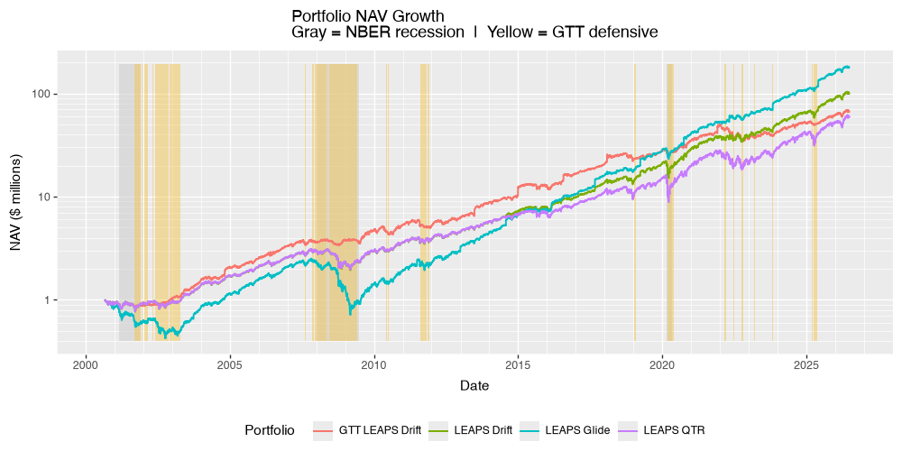

## 1. Introduction & Theoretical Framework

### Lifecycle Investing (Ayres & Nalebuff, 2010)

Standard target-date and asset allocation models traditionally prescribe high equity exposure in youth, gradually tapering toward fixed income near retirement. Ayres and Nalebuff (2010) demonstrated that this conventional schedule suffers from severe **temporal** concentration risk: investors hold the vast majority of their dollar-weighted equity exposure late in life, when their capital base is large, while holding negligible absolute equity delta during their early career when their human capital is highest.

By applying leverage early in the lifecycle (e.g., via deep in-the-money options), investors can smooth their dollar-weighted equity exposure across time (time-diversification), reducing terminal wealth variance without sacrificing expected growth.

### Modern Portfolio Theory (MPT) & Risk-Parity Integration

While pure Ayres-Nalebuff leverage applies concentrated equity exposure, surrounding a leveraged equity core ($95\Delta$ LEAPS) with a multi-asset shell applies Modern Portfolio Theory and Risk-Parity principles. 

By combining leveraged US equity delta with uncorrelated, non-equity risk drivers—trend-following managed futures (crisis alpha), real assets (inflation/currency devaluation protection), and intermediate fixed income (liquidity buffer and flight-to-quality)—the portfolio achieves structural downside protection. This framework harvests equity upside while suppressing volatility drag ($\sigma^2 / 2$) and drawdowns during systemic market dislocations.

---

## 2. Backtest Construction & Architecture

### Data & Timeline
* **Historical Horizon:** September 2000 through June 2026 (25.8 years / 310 monthly periods).
* **Stress Regimes Captured:** Dot-Com Crash (2000–2003), Great Financial Crisis (2007–2009), COVID Liquidity Shock (2020), and Federal Reserve Rate Hike / Inflation Shock (2022).
* **Cash Flow Dynamics:** Initial $1M seed capital with ongoing $10,000/month contributions ($4.1M lifetime contributions).

### Baseline Asset Mix
The core baseline allocation targets **105% total global equity delta** alongside a **30% multi-asset defensive shell**:

| Asset / Instrument | Baseline Weight | Asset Class / Portfolio Role |
| :--- | :---: | :--- |
| **`VTI_LEAPS`** | **42.5%** | 50% ITM $95\Delta$ Calls ($\sim 78\%$ US Equity Delta) |
| **`VXUS`** | **27.5%** | Unleveraged Ex-US Equity Core ($\sim 27.5\%$ Global Growth Delta) |
| **`KMLM`** | **10.0%** | Trend-Following Managed Futures CTA (Crisis Alpha / Rate Protection) |
| **`GLD`** | **10.0%** | Gold / Real Asset & Stagflation Hedge |
| **`VGIT`** | **5.0%** | Intermediate US Treasuries (Flight-to-Quality & Liquidity Reserve) |
| **`MUB`** | **5.0%** | National Municipal Bonds (Tax-Free Yield Buffer) |

---

### Rebalancing Paradigms & Config Parameters

#### A. Static DRIFT (`RebalanceRule.DRIFT`)
* Maintains constant, stationary target weights ($42.5\%$ LEAPS / $57.5\%$ Base) throughout the multi-decade horizon.
* Executes two-sided rebalancing whenever any asset weight breaches relative drift threshold bands (`DRIFT_BAND_RELATIVE`).

#### B. Dynamic Glide Path (`GlidepathConfig`)
Formalizes dynamic de-leveraging indexed to the wealth multiple of $R_f$-hurdle-adjusted contributed capital:

$$\text{Contributed}_{\text{hurdle}}(t) = \text{Contributed}_{\text{hurdle}}(t-1) \times (1 + r_f(t))^{1/12} + \text{Contribution}_t$$

$$m(t) = \frac{\text{NAV}(t)}{\text{Contributed}_{\text{hurdle}}(t)}$$

* **Index Variable ($m$):** De-leveraging only begins once $m(t) > 1.0$ (i.e., after clearing the 13-week T-bill risk-free return hurdle on actual cash contributions).
* **Target Weight Schedule:** 
  $$w_{\text{LEAPS}}(m) = \text{floor} + (w_0 - \text{floor}) \times \exp\left(-\lambda \times \max(m - 1.0, 0)\right)$$
  - Where $\lambda = \frac{\ln(2)}{\text{half life multiple}}$.

* **Freed Weight Redistribution (`vti_alpha`):**
  * Freed LEAPS weight, $w_{\text{freed}} = w_0 - w_{\text{LEAPS}}(m)$, is routed symmetrically:
    * A. $\text{Target Weight}_{\text{VTI 1x}} = w_{\text{freed}} \times \text{vti alpha}$
    * B. The remaining $(1 - \text{vti alpha})$ expands the multi-asset base proportionally.

* **Primary Configuration Profile (`GlidepathConfig`):**
  * `half_life_multiple = 1.0` (Active weight halves when NAV doubles hurdle capital)
  * `floor = 0.0` or `0.025` (Options phase down to zero / minimal floor at high wealth levels)
  * `vti_alpha = 0.65` (65% of freed weight transitions to 1x VTI, 35% to multi-asset base)

---

## 3. Backtest Findings & Key Conclusions

### Performance Summary Table (2000–2026)

| Strategy Variant | Ann. Return (CAGR) | Ann. Volatility | Max Drawdown | Sharpe Ratio | Sortino Ratio | Terminal NAV |
| :--- | :---: | :---: | :---: | :---: | :---: | :---: |
| **`LEAPS QTR`** | 12.87% | 20.72% | 45.19% | 0.6011 | 0.5021 | $60.2M |
| **`LEAPS DRIFT`** | 15.25% | 16.44% | 37.85% | **0.8357** | **0.7818** | $101.1M |
| **`LEAPS GLIDE`** *(hl=1.0, fl=0.025, α=0.65)* | **16.54%** | 21.98% | 74.92% | 0.7234 | 0.6628 | **$209.0M** |
| **`GTT LEAPS DRIFT`** | 13.97% | 15.06% | 30.77% | 0.8217 | 0.8671 | $67.3M |

---

### Core Analytical Takeaways

#### 1. GTT (Gain/Trend Timing) is Dominated by Multi-Asset Architecture
* **Macro-Gate Failures:** GTT relies on dual trend/unemployment triggers ($\text{UE} > \text{SMA}_{12}$ AND $P < \text{SMA}_{200}$) to move into cash/bonds. During non-recessionary supply shocks (like the 2022 inflation/rate-hike surge), unemployment remained tight, leaving GTT fully exposed to duration and equity drawdowns.
* **Structural Interaction Bugs:** Coupling GTT with dynamic schedules (`GLIDE`) causes re-entry seeding shocks. When GTT flips `DEFENSIVE -> RISK_ON`, initializing options at baseline $w_0$ forces the engine to immediately execute a massive $70\%+$ market-sale of newly acquired option contracts on the subsequent daily step due to elevated $m(t)$ levels. 
* **Conclusion:** Static multi-asset diversification (`KMLM` + `GLD`) provides superior, un-gated crisis alpha without execution friction or whipsaw risk.

#### 2. DRIFT and GLIDE Superiority Over Quarterly Rebalancing (`QTR`)
* **`DRIFT` vs. `QTR`:** Both `LEAPS DRIFT` (Sharpe $0.8357$) and `LEAPS GLIDE` (Sharpe $0.7234$) vastly outperform rigid calendar quarterly rebalancing (`LEAPS QTR`, Sharpe $0.6011$). 
* Quarterly rebalancing blindly forces sales on schedule, whereas threshold-based `DRIFT` captures momentum trends and only trades when relative asset bounds are breached.

#### 3. Strategic Selection Framework: `LEAPS DRIFT` vs. `LEAPS GLIDE`

* **`LEAPS DRIFT` (The Optimal Risk-Adjusted Engine):**
  * Achieves institutional-grade risk-adjusted efficiency (**Sharpe 0.8357 / Sortino 0.7818**).
  * Caps full-period Max Drawdown below $38\%$, dramatically beating alternatives.
  * Fixed rebalancing policy ensures insulation from early sequence-of-returns risk.

* **`LEAPS GLIDE` (The Maximum Terminal Wealth Compounder):**
  * Generates massive terminal wealth (**$209.0M** vs. $101.1M for DRIFT) by using options as a temporary booster stage. 
    - **Beware:** this occured in a backtest that captures the longest/largest VTI bull market in history. Past performance != future performance.
  * Systematically converts high-volatility option delta into unleveraged $1\text{x}\ VTI$ and multi-asset capital as $m(t)$ expands, eliminating option theta/vega drag late in life.
  * **Trade-off:** High early-sequence drawdown risk ($\sim 74\%$ Max DD during 2000–2003 / 2007–2009) before $m(t)$ has accumulated a capital surplus.