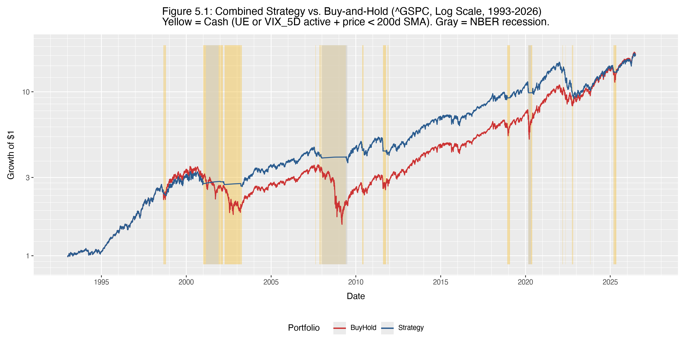

# GTT Market Timing Signal — EDA Findings

**Analysis window:** 1967–2026 (Sections 1–3); 1993–2026 (Sections 4–5, limited by VIX availability)  
**Benchmark:** ^GSPC  
**Reference:** Philosophical Economics, "In Search of the Perfect Recession Indicator" (2016)

---

## 1. Claims Signal Is Not Useful

The core hypothesis of the analysis was that IC4WSA (weekly 4-week unemployment claims) could
replace or supplement the monthly UNRATE signal, either via a claims/payrolls ratio
(`IC4WSA / PAYEMS`) or a detrended raw IC4WSA series (normalized by 260-week trend MA).

**The claims signals failed on every dimension:**

- The claims ratio (`Ratio_26W`, `Ratio_52W`) triggered at only 1 of 8 NBER recessions
  (1981 only) within a 12-month pre-recession window.
- The detrended raw IC4WSA signals (`Raw_26W`, `Raw_52W`) never triggered for any recession
  or bear market episode across the entire 1967–2026 history.
- On the publication-lag-adjusted comparison (the claimed weekly-frequency advantage), the
  claims ratio fired *later* than UNRATE after accounting for reporting lags: −75 days in 1981
  and −502 days in 2007. The frequency advantage does not exist in the data.

**Conclusion:** IC4WSA adds no information over UNRATE for this signal design. Dropped from
further analysis.

---

## 2. UNRATE MA12 Signal Is Reliable but Slow

The UE_12M signal (`UNRATE >= trailing 12-month MA`) is the workhorse of the GTT approach.

**Strengths:**
- Fired ahead of 6 of 8 NBER recessions (1967–2026), with typical lead times of 180–360 days.
- Led most employment-driven bear markets by 200–360 days (1970, 1974, 1982, 2001, 2008).
- Near-zero false positive rate — essentially silent during non-recessionary periods.

**Weaknesses:**
- Fires late relative to fast-moving bear markets. In 2020 it triggered only 2 days before the
  NBER recession start and 11 days before the ^GSPC entered bear territory.
- Completely missed the 2022 bear market: UE stayed historically low throughout the
  rate-hike cycle and the signal never fired until November 2022, 91 days *after* the bear
  market began.
- Signal remains elevated for months post-recession, causing the strategy to sit partially
  in cash during early recoveries (2003: −6.7%, 2009: −9.2%, 2010: −5.8%).

---

## 3. VIX P90 Signal: Frequency vs. Precision Tradeoff

Six VIX persistence variants were tested against a P90 threshold (~0.272, i.e. ~27.2% VIX):

| Signal    | Episodes (1993–2026) | Description              |
|-----------|---------------------|--------------------------|
| VIX_1D    | 73                  | Single day above P90     |
| VIX_3D    | 52                  | 3 consecutive days       |
| VIX_3in5  | 58                  | 3 of last 5 days         |
| VIX_3in10 | 67                  | 3 of last 10 days        |
| VIX_5in10 | 47                  | 5 of last 10 days        |
| VIX_5D    | 43                  | 5 consecutive days       |

**VIX_3D/VIX_3in5** fire earliest and most consistently, leading the 2001 recession by 320 days
and the 2008 bear by 327 days. However, they also produce 52–58 episodes — too noisy for an
OR-logic combination with UE.

**VIX_5D** (5 consecutive days ≥ P90) was selected for the combined strategy:
- 43 episodes over 33 years (~1.3 per year on average)
- Led the 2022 bear market by 137 days — the one scenario where UE failed entirely
- Trade-off: fires *at* panic peaks (2001: −10 days, 2007: −263 days, 2020: −5 days),
  meaning it catches volatility spikes rather than leading most recessions

**Key insight from Table 4.2b:** No single VIX variant is consistently early. VIX_1D/VIX_3D
lead recessions when they develop gradually (2001: +322 days); VIX_5D leads when there is a
sharp dislocation (2022: +137 days). The two signal types are genuinely complementary.

---

## 4. Combined Strategy Performance (1993–2026)

**Decision rule:**
1. If `UE_12M = 0` AND `VIX_5D = 0` → 100% Long
2. If either signal active AND `^GSPC ≥ 200d SMA` → 100% Long
3. If either signal active AND `^GSPC < 200d SMA` → 100% Cash (earns T-bill rate)

Position lagged 1 day to avoid look-ahead bias. Cash earns the 3-month T-bill rate (^IRX).

### Table 5.1: Strategy vs. Buy-and-Hold

| Metric          | Strategy  | Buy & Hold |
|-----------------|-----------|------------|
| CAGR            | 8.81%     | 8.86%      |
| Ann Std         | 13.24%    | 18.35%     |
| Sharpe          | 0.52      | 0.42       |
| Sortino         | 0.40      | 0.33       |
| Calmar          | 0.22      | 0.16       |
| Omega           | 1.10      | 1.08       |
| Skewness        | −0.502    | −0.149     |
| Excess Kurtosis | 4.920     | 10.691     |
| Max Drawdown    | −40.07%   | −56.78%    |
| Total Return    | 1582.86%  | 1608.95%   |
| Pct Invested    | 85.1%     | 100.0%     |

**Risk-adjusted performance is meaningfully better** across all metrics: Sharpe +24%, Sortino
+21%, Calmar +38%, max drawdown reduced by 1,671bp. CAGR and total return are essentially
equal after accounting for T-bill income on cash periods.

**Excess kurtosis (4.92 vs 10.69) is the clearest evidence the strategy works as designed.**
A value of 10.69 for B&H reflects the presence of extreme daily moves (Oct 1987, Sep 2008,
Mar 2020). The strategy cuts kurtosis by more than half by stepping out during the most
extreme episodes — it is not merely reducing drawdown, it is surgically removing the fattest
tail events from the return distribution.

**Skewness (−0.50 vs −0.15) is the uncomfortable trade-off.** The strategy is *more*
negatively skewed than B&H. By exiting at volatility peaks — particularly VIX_5D triggering
at panic bottoms — the strategy misses the large positive snap-back days that follow crashes.
B&H captures both the crash and the recovery; the strategy captures the crash but not always
the re-entry, producing a more left-skewed excess return distribution.

### Where the strategy earns its keep

The entire alpha is generated in three recession episodes:

| Year | Strategy | B&H   | Excess | Cash Days |
|------|----------|-------|--------|-----------|
| 2001 | +0.5%    | −13.0% | +13.5% | 247       |
| 2002 | −3.2%    | −23.4% | +20.2% | 234       |
| 2008 | +1.3%    | −38.5% | +39.8% | 253       |

Without these three saves, cumulative drag from whipsawing and slow re-entry would leave the
strategy materially behind buy-and-hold.

### Known failure modes

**2022 (worst year, −18.3% excess):**
- UE_12M never fired. Unemployment remained historically low throughout the rate-hike cycle.
- VIX_5D triggered only briefly (31 cash days, 12.4% of year) — likely during panic bottoms
  within the bear, exiting exactly when the market bounced and re-entering before the next
  leg down.
- The 200d SMA filter added further lag. The strategy participated in most of the down move.
- Root cause: the GTT signal is not designed for inflation/rate-driven drawdowns where the
  labor market remains tight.

**Slow exit from recessions (recurring tax):**
- UE_12M stays elevated for months after the recession trough, keeping the strategy partially
  in cash during the early recovery.
- 2003: −6.7% (UE active 75% of year), 2009: −9.2% (UE active 100%), 2011: −12.6% (pure
  VIX false positive — European debt crisis/US debt ceiling), 2019: −9.3% (22 cash days in
  a strong year).

**Fast exogenous shocks (2020, 2025):**
- COVID recovery (2020: −8.1%): strategy stepped out during the March panic and missed a
  portion of the V-shaped recovery.
- 2025 tariff panic: strategy 83.2% invested (42 cash days), underperformed by −4.9%.
  VIX_5D requires 5 *consecutive* days — a fast spike-and-recovery doesn't satisfy this.

### 2023–2026 bull market

The strategy matched buy-and-hold almost exactly in 2023–2024 (near-zero cash days despite
UE_12M being active throughout 2024). The 200d SMA filter did its job: UE was elevated but
the market kept trending above its 200d SMA, so the strategy stayed fully invested. The
modest gap in 2025 (−4.9%) reflects the 42 cash days during the tariff shock period.

---

## 5. Conclusions

1. **The UE MA12 signal works for employment-driven recessions** (2001, 2008) and provides
   substantial drawdown protection. Its limitations are well-understood: it is blind to
   rate-driven and exogenous shocks, and it exits slowly.

2. **VIX_5D provides genuine complementary coverage** for sharp dislocations (2022) but fires
   at volatility peaks rather than leading most recessions. It is noisy in isolation (43
   episodes) but less damaging in combination with the 200d SMA filter.

3. **The 200d SMA filter is load-bearing.** Without it, the OR-combination of UE and VIX_5D
   would generate excessive cash periods and meaningful return drag. The price trend test
   prevents the strategy from exiting during elevated-fear, still-trending markets.

4. **Risk-adjusted return is the correct lens.** The strategy sacrifices ~26bp of CAGR for a
   dramatically smoother ride: −16.7pp lower max drawdown, 24% better Sharpe. For a
   long-horizon investor who cares about sequence-of-returns risk, this is a meaningful
   improvement.

5. **Open questions:**
   - Can a fast-exit mechanism (e.g. price drops X% below 200d SMA in N days) address the
     2022 failure without introducing new false positives?
   - Should VIX_3D replace VIX_5D to capture the 2007 recession earlier (+136 days vs
     −263 days), accepting slightly more noise (52 vs 43 episodes)?
   - Backtesting on ^GSPC total return (with dividends) would modestly improve both series
     and is the correct comparison for a real implementation.

---

## 6. Leverage Sensitivity (1.4× Estimated)

Assuming 140% long equity when invested, borrowing 40% of capital at T-bill + ~50bps spread.
Cash periods are unchanged (still 0% equity exposure, earning T-bill rate).

| Metric          | Unleveraged | 1.4× Leveraged (est.) | B&H      |
|-----------------|-------------|----------------------|----------|
| CAGR            | 8.81%       | ~11.1%               | 8.86%    |
| Ann Std         | 13.24%      | ~18.5%               | 18.35%   |
| Sharpe          | 0.52        | ~0.49                | 0.42     |
| Sortino         | 0.40        | ~0.37                | 0.33     |
| Calmar          | 0.22        | ~0.20                | 0.16     |
| Omega           | 1.10        | ~1.07                | 1.08     |
| Skewness        | −0.502      | ~−0.50               | −0.149   |
| Excess Kurtosis | 4.920       | ~4.92                | 10.691   |
| Max Drawdown    | −40.07%     | ~−56%                | −56.78%  |

**Key takeaway:** 1.4× leverage converts the strategy's risk-adjusted advantage almost entirely
into raw return (+~225bp CAGR over B&H) while surrendering the drawdown protection that is the
strategy's primary benefit. Max drawdown rises from −40% to ~−56% — statistically identical to
B&H. All risk-adjusted ratios worsen slightly due to borrowing drag on the numerator.

Leverage is approximately Sharpe-neutral in theory but slightly negative in practice: borrowing
costs trim excess return while volatility scales linearly. The 2022 worst year (−37.7%
unleveraged) becomes ~−52.8% leveraged — a larger absolute loss than B&H in the same year
(−19.4%), with no recession signal to justify the positioning.

--- 

## Appendix: GTT vs Buy and hold annual breakdown

### Table 5.2: Annual Breakdown (Strat vs B&H, signal activity, cash days)

| Year | Strat_Return | BH_Return | Pct_Invested | UE_Active_Pct | VIX5D_Pct | Cash_Days | Excess |
| --- | --- | --- | --- | --- | --- | --- | --- |
| 1993 | 7.1% | 7.1% | 100.0% | 0.0% | 0.0% | 0 | 0.0% |
| 1994 | -1.5% | -1.5% | 100.0% | 0.0% | 0.0% | 0 | 0.0% |
| 1995 | 34.1% | 34.1% | 100.0% | 40.9% | 0.0% | 0 | 0.0% |
| 1996 | 20.3% | 20.3% | 100.0% | 25.6% | 0.0% | 0 | 0.0% |
| 1997 | 31.0% | 31.0% | 100.0% | 0.0% | 5.5% | 0 | 0.0% |
| 1998 | 18.1% | 26.7% | 83.7% | 8.3% | 18.3% | 41 | -8.5% |
| 1999 | 19.5% | 19.5% | 100.0% | 0.0% | 1.2% | 0 | 0.0% |
| 2000 | -10.1% | -10.1% | 100.0% | 9.1% | 0.0% | 0 | 0.0% |
| 2001 | 0.5% | -13.0% | 0.4% | 100.0% | 14.9% | 247 | 13.5% |
| 2002 | -3.2% | -23.4% | 7.1% | 90.9% | 31.7% | 234 | 20.2% |
| 2003 | 19.7% | 26.4% | 71.8% | 74.6% | 13.9% | 71 | -6.7% |
| 2004 | 9.0% | 9.0% | 100.0% | 0.0% | 0.0% | 0 | 0.0% |
| 2005 | 3.0% | 3.0% | 100.0% | 0.0% | 0.0% | 0 | 0.0% |
| 2006 | 13.6% | 13.6% | 100.0% | 0.0% | 0.0% | 0 | 0.0% |
| 2007 | -6.1% | 3.5% | 84.1% | 59.0% | 0.0% | 40 | -9.6% |
| 2008 | 1.3% | -38.5% | 0.0% | 100.0% | 28.5% | 253 | 39.8% |
| 2009 | 14.3% | 23.5% | 57.1% | 100.0% | 43.3% | 108 | -9.2% |
| 2010 | 7.0% | 12.8% | 92.9% | 40.9% | 7.1% | 18 | -5.8% |
| 2011 | -12.6% | -0.0% | 75.4% | 0.0% | 24.6% | 62 | -12.6% |
| 2012 | 13.4% | 13.4% | 100.0% | 0.0% | 0.0% | 0 | 0.0% |
| 2013 | 29.6% | 29.6% | 100.0% | 0.0% | 0.0% | 0 | 0.0% |
| 2014 | 11.4% | 11.4% | 100.0% | 0.0% | 0.0% | 0 | 0.0% |
| 2015 | -0.7% | -0.7% | 100.0% | 0.0% | 0.0% | 0 | 0.0% |
| 2016 | 9.5% | 9.5% | 100.0% | 16.7% | 0.0% | 0 | 0.0% |
| 2017 | 19.4% | 19.4% | 100.0% | 0.0% | 0.0% | 0 | 0.0% |
| 2018 | 1.1% | -6.2% | 93.2% | 7.6% | 0.0% | 17 | 7.4% |
| 2019 | 19.6% | 28.9% | 91.3% | 8.3% | 0.0% | 22 | -9.3% |
| 2020 | 8.1% | 16.3% | 76.3% | 58.9% | 24.9% | 60 | -8.1% |
| 2021 | 26.9% | 26.9% | 100.0% | 0.0% | 0.0% | 0 | 0.0% |
| 2022 | -37.7% | -19.4% | 87.6% | 0.0% | 12.4% | 31 | -18.3% |
| 2023 | 20.0% | 24.2% | 96.8% | 67.2% | 0.0% | 8 | -4.2% |
| 2024 | 23.3% | 23.3% | 100.0% | 100.0% | 0.0% | 0 | 0.0% |
| 2025 | 11.5% | 16.4% | 83.2% | 58.4% | 3.6% | 42 | -4.9% |
| 2026 | 8.7% | 8.7% | 100.0% | 0.0% | 0.0% | 0 | 0.0% |