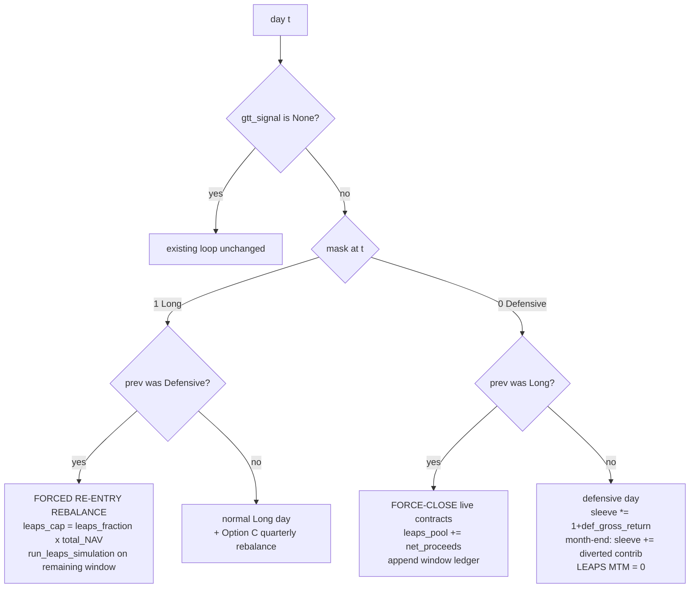

# Project: F-10 `run_backtest` GTT Branch — Work Breakdown

Decomposition of the single `gtt_spec.json` feature **F-10-RUN-BACKTEST** into four
incremental, independently-testable slices. The algorithmic contract is fixed upstream
(`plans/implement_gtt.md` §4.2 / A9 / A10 and `gtt_spec.json`); this document only
sequences the implementation and pins down the one representational ambiguity the spec
leaves open (the defensive-sleeve / `leaps_pool` model).

F-10 remains **one** spec feature. It ships as **four commits**; `status` flips to
`pending_judge` only after commit 4 lands and the full suite is green.

---

## 1. System Overview

`run_backtest` gains an optional `gtt_signal: GttSignalData | None = None`. When `None`,
behavior is byte-for-byte identical to today (hard regression gate). When present, the
daily loop is governed by a 0/1 `position_mask`:

- **Long day (mask == 1):** existing behavior — base equity + carved-out LEAPS.
- **Defensive day (mask == 0):** GTT-governed keys (`VTI` and `VTI_LEAPS`) are zeroed;
  their freed capital rides a **defensive sleeve**; live LEAPS are force-closed and their
  net proceeds join the sleeve (as `leaps_pool`). Non-governed base assets (e.g. `VXUS`)
  ride their own returns unchanged.
- **Long→Defensive transition:** force-close every live contract (`close_leaps_contract`),
  seed `leaps_pool`, append the closed window's ledger.
- **Defensive→Long transition (forced re-entry rebalance, A9):** re-anchor the whole
  portfolio to `target_weights` on `total_NAV`; LEAPS capital = `leaps_fraction × total_NAV`
  seeds a fresh `run_leaps_simulation` for the new Long window.



## 2. Tech Stack & Dependencies

No new dependencies. Pure Python (`pandas`), `pytest`. Reuses F-08 primitives
(`close_leaps_contract`, `LeapsGttCloseEvent`, `_live_contracts`) and `run_leaps_simulation`.
`build.dev_install_cmd = "uv pip install -e ."`.

## 3. Data Schema / Type Definitions

No new public dataclasses. `BacktestResult` shape is unchanged. Internal loop state added:

| Name | Type | Meaning |
|---|---|---|
| `defensive_sleeve` | `float` | Blended value of all GTT-freed capital (freed VTI base equity **+** `leaps_pool`), compounded daily by `defensive_gross_return`. `0.0` while Long. |
| `leaps_pool` | `float` | The LEAPS-origin sub-component of `defensive_sleeve` (force-close proceeds + diverted `leaps_monthly`), tracked separately only to seed nothing but to satisfy the compounding assertion and reporting. Compounds by the **same** `defensive_gross_return`. |
| `current_leaps_ledger` | `LeapsLedger \| None` | Active Long-window ledger; `None` during a defensive window. |
| `all_window_ledgers` | `list[LeapsLedger]` | Per-window ledgers, concatenated at loop end. |
| `all_gtt_closes` | `list[LeapsGttCloseEvent]` | Force-close events across all boundaries. |

### 3.1 Defensive-sleeve representation (the one resolved ambiguity)

The spec states two things that can conflict over a multi-day window:
(1) *"defensive_weights assets carry the redistributed capital"* + *"R_f earns rfr/252"*
(implies per-ticker holdings), and
(2) *"leaps_pool ... compounded by defensive_gross_return"* (implies a single blended scalar).

Per-ticker holdings that each ride their **own** return drift away from
`Π(1 + defensive_gross_return_t)`, breaking criterion (2). **Resolution — decomposed
sleeve:**

- Hold GTT-freed capital as a single scalar `defensive_sleeve`, compounded daily by
  `defensive_gross_return_t = Σ_i defensive_weights[i]·r_i(t)` (with `R_f → rfr(t)/252`).
- For `weight_history`, **decompose** the sleeve at `defensive_weights` proportions:
  `weight[i] += defensive_weights[i] · defensive_sleeve / total_NAV` (a synthetic `R_f`
  column is added). `VTI` and `VTI_LEAPS` weights are exactly `0`. Rows still sum to 1.0.
- `leaps_pool ⊆ defensive_sleeve`, compounded by the identical factor, so criterion (2)
  holds to 1e-9 and `total_NAV = base_holdings + defensive_sleeve` stays exact.

This honors the chosen "fold pool into defensive holdings" intent (pool visible in weights,
rows sum to 1, consistent `total_NAV`) **and** every acceptance criterion. Non-GTT base
assets (`VXUS`) remain ordinary per-ticker holdings riding their own returns.

## 4. Component/Module Breakdown (API Definitions)

Public signature (unchanged except the new trailing optional param):

```python
def run_backtest(
    return_data: ReturnData,
    price_data: PriceData,
    config: PortfolioConfig,
    gtt_signal: GttSignalData | None = None,   # NEW; None => exact legacy behavior
) -> BacktestResult: ...
```

New **private, pure** pre-compute helpers in `portfolio.py` (slice F-10b):

```python
def _gtt_governed_keys(target_weights: dict[str, float]) -> set[str]:
    """GTT_EQUITY_TICKERS present in target_weights, plus their '*_LEAPS' variants."""

def _reindex_position_mask(mask: pd.Series, index: pd.DatetimeIndex) -> pd.Series:
    """Reindex mask to index (ffill), default missing/leading to 1 (Long); -> int Series."""

def _defensive_gross_return(
    returns: pd.DataFrame, rfr_series: pd.Series, defensive_weights: dict[str, float],
) -> pd.Series:
    """Daily blended sleeve return: Σ w_i·r_i with the 'R_f' key -> rfr/252."""
```

Validation (slice F-10a), raised at top of `run_backtest`:
- `gtt_signal` xor `config.gtt_config` set → `ValueError`.
- any non-`R_f` `defensive_weights` ticker absent from `return_data.returns.columns`
  → `ValueError`.

## 5. Step-by-Step Implementation Roadmap

Each phase = one commit, each with green tests before moving on.

### Phase F-10a — Signature, validation, no-op path *(regression gate)*
- Add `gtt_signal` param + docstring; wire the two `ValueError`s.
- Guarantee the `gtt_signal is None` path is untouched (early split; no code motion in the
  legacy branch).
- **Tests:** `gtt_signal=None` exact-equality vs pre-change on the existing corpus
  (nav, weight_history, return_series, leaps_ledger); XOR `ValueError` both directions
  (match message); missing defensive ticker `ValueError`.

### Phase F-10b — Pure pre-compute helpers
- Implement the three helpers above; call sites stubbed (not yet driving the loop).
- **Tests (value assertions, 1e-9):** governed-keys set for VTI/VTI_LEAPS and the no-VTI
  no-op case; mask reindex across a holiday gap (ffill) and leading-NaN → 1; defensive
  blend equals hand-computed `Σ w_i r_i` including the `R_f → rfr/252` term; boundary:
  a defensive_weights key with weight 0.

### Phase F-10c — Equity-only GTT branch *(no LEAPS)*
- Inline the daily GTT branch for the non-LEAPS case: zero `VTI`; route freed VTI capital
  + VTI-share of month-end contribution into `defensive_sleeve`; compound sleeve by
  `defensive_gross_return`; Long↔Defensive transitions; forced re-entry rebalance restores
  `base_target_w` on `(1-leaps_fraction)·total_NAV` (here `leaps_fraction==0`); Option C
  (quarterly rebalance runs, then GTT override re-applied); `weight_history` sleeve
  decomposition + synthetic `R_f` column; `VTI` weight 0.
- **Tests:** all-Long mask ≡ no-GTT (1e-9 terminal NAV); synthetic defensive window
  (VTI weight exactly 0, defensive redistribution present, `R_f` earns `rfr/252`); forced
  re-entry restores `target_weights` within 1e-9 on first Long day; rebalance-date ==
  defensive-day ordering (Option C).

### Phase F-10d — LEAPS segmentation + ledger assembly
- Add `leaps_pool`, `current_leaps_ledger`, `all_window_ledgers`, `all_gtt_closes`.
- Replace the single up-front `run_leaps_simulation` with per-Long-window simulations:
  the initial window is seeded from `initial_nav·leaps_fraction`; each re-entry window is
  seeded from `leaps_fraction·total_NAV`.
- Long→Defensive: force-close live contracts (`close_leaps_contract`) at that day's spot/
  iv/rfr; `leaps_pool += Σ net_proceeds`; append window ledger; `current_leaps_ledger=None`.
- Defensive day: `leaps_pool` (⊆ sleeve) compounds by `defensive_gross_return`; month-end
  adds `leaps_monthly`; LEAPS MTM naturally 0 (no live contracts).
- Defensive→Long: `leaps_capital = leaps_fraction·total_NAV`; `run_leaps_simulation` over
  the remaining-window prices with `initial_capital=leaps_capital`; `leaps_pool=0`.
- Loop end: assemble final `LeapsLedger` (concat contracts/rolls/partial_closes across
  windows; `gtt_close_events=tuple(all_gtt_closes)`).
- **Tests:** no-LEAPS-GTT ≡ F-10c baseline AND no-GTT-LEAPS ≡ legacy baseline;
  `leaps_pool` at re-entry == closed proceeds compounded by `defensive_gross_return` +
  diverted `leaps_monthly` (1e-9); `TAX_SHELTERED` → zero close tax across all events;
  timeline ends inside defensive window (pool reported in `gtt_close_events`, no dangling
  open contracts); whipsaw L→D→L→D produces one close-set per boundary.

## 6. Known Assumptions

- Inherits A1–A10 from `implement_gtt.md`. Re-entry LEAPS capital is `leaps_fraction ×
  live total_NAV` (A9), knowable only inside the loop → segmentation lives here (A10).
- Monthly contribution split (`leaps_monthly` / `base_contribution`) stays fixed dollar
  amounts set at startup; intra-window drift is corrected by the next quarterly rebalance.
- GTT primarily exercised under `QUARTERLY`. `DRIFT + GTT` rides the same daily override;
  the existing `DRIFT` partial-close/`leaps_scale` machinery is preserved for the
  `gtt_signal is None` path and not extended by F-10 (documented, not a new feature).
- `defensive_gross_return` uses only tickers named in `defensive_weights`; `R_f` uses
  `rfr(t)/252`.

## 7. Potential Edge Cases & Risks

| Case | Handling |
|---|---|
| Rebalance date == defensive day | Quarterly rebalance runs on base holdings, then GTT override re-applied (Option C). |
| Rebalance date == re-entry day | Forced re-entry rebalance fires; scheduled quarterly rebalance is redundant → skipped/merged. |
| `position_mask` holiday misalignment | `_reindex_position_mask` ffill; leading NaN → 1 (Long). |
| `gtt_config` set but target holds no VTI/VTI_LEAPS | `_gtt_governed_keys` empty → GTT is a no-op, no crash. |
| Re-entry pool too small for a contract | `create_leaps_contract` floors `n_contracts` to 0; capital rides base sleeve until next month-end purchase. |
| Timeline ends inside a defensive window | `leaps_pool` reported via `gtt_close_events`; no dangling open contracts; sleeve value in terminal NAV. |
| Whipsaw L→D→L→D | One force-close set + one re-entry per boundary; tax drag accumulates in `gtt_close_events`. |
| **Pool/sleeve drift (design risk)** | Resolved by the decomposed-sleeve model (§3.1): single scalar compounded by the blended return, decomposed for display. |
